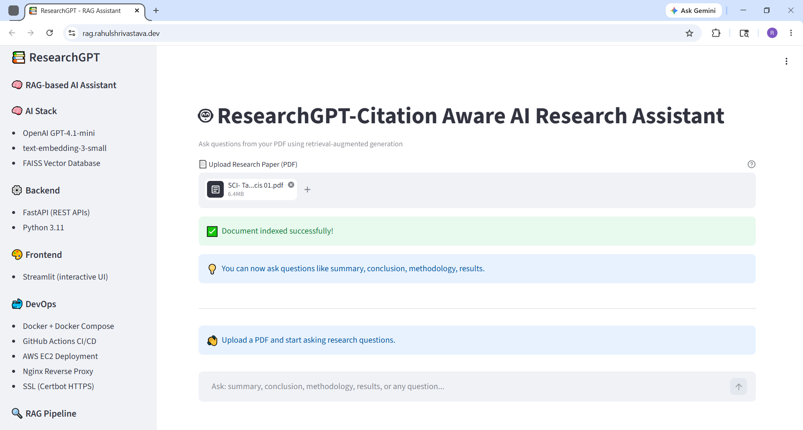
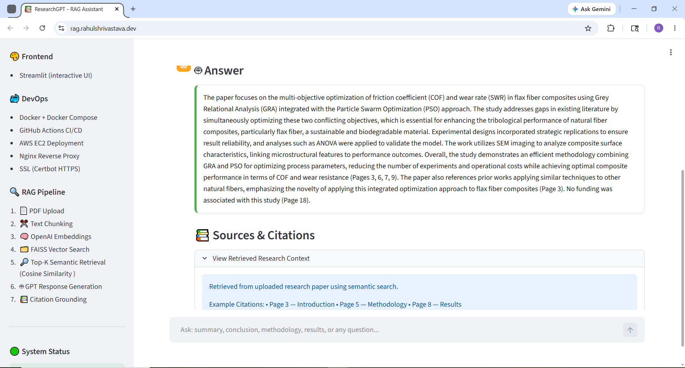
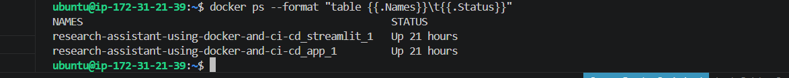

# 📚 ResearchGPT — Citation-Aware RAG System

A production-ready Retrieval-Augmented Generation (RAG) system that enables users to upload research papers (PDFs) and ask intelligent, context-aware questions with citation-grounded responses.

---

## 🚀 Live Demo

🌐 [ResearchGPT Live Application](https://rag.rahulshrivastava.dev)

---

## 📌 Overview

ResearchGPT is a full-stack AI application designed for semantic document question answering using Retrieval-Augmented Generation (RAG).

Users can upload research papers in PDF format and interact with them via natural-language queries. The system retrieves the most relevant document chunks using FAISS vector similarity search and generates grounded responses using OpenAI LLMs with citation support.

---

## 🧠 Why RAG?

Traditional LLMs may generate hallucinated or non-grounded responses when domain-specific context is unavailable.

This project uses Retrieval-Augmented Generation (RAG) to retrieve relevant document chunks before generating answers, improving:

- factual grounding
- explainability
- context awareness
- response reliability

---

## 🚀 Key Features

- 📄 Upload and process PDF research papers
- 🔎 Top-K semantic retrieval using FAISS vector database
- 🤖 AI-powered question answering using OpenAI GPT models
- 📚 Citation-aware and grounded responses
- 💬 Interactive chat-based UI using Streamlit
- ⚡ FastAPI backend for scalable API architecture
- 💬 Conversational research interaction
- 🔄 Real-time document indexing and retrieval
- 🐳 Containerized deployment using Docker  
- ☁️ AWS EC2 cloud deployment with HTTPS

---

## 🏗️ System Architecture

```text
PDF Upload
   ↓
Text Extraction (PyPDF)
   ↓
Chunking Strategy
   ↓
OpenAI Embeddings
   ↓
FAISS Vector Database
   ↓
User Query
   ↓
Top-K Semantic Retrieval (Cosine Similarity)
   ↓
LLM (GPT-4.1-mini)
   ↓
Final Answer + Citations
```

---

## 📸 Application Preview

### Main RAG Interface


### Citation-Aware Responses


### Docker Deployment on AWS EC2


---

## ⚙️ Tech Stack

### 🧠 AI / ML
- OpenAI GPT-4.1-mini
- OpenAI Embeddings (`text-embedding-3-small`)
- FAISS Vector Database
- Cosine Similarity Retrieval

### ⚙️ Backend
- FastAPI
- Python 3.11

### 🎨 Frontend
- Streamlit

### 🐳 DevOps / Deployment
- Docker & Docker Compose
- GitHub Actions CI/CD
- AWS EC2 (Ubuntu)
- Nginx Reverse Proxy
- SSL (Certbot HTTPS)

---

## 🚀 Deployment Architecture

- Containerized microservice architecture
- FastAPI backend container
- Streamlit frontend container
- Automated CI/CD pipeline using GitHub Actions
- Docker-based deployment to AWS EC2
- Nginx reverse proxy configuration
- HTTPS secured using Certbot SSL

---

## 📦 Local Setup

### 1️⃣ Clone Repository

```bash
git clone https://github.com/rahulshrivastava080-create/Research-Assistant-using-docker-and-CI-CD.git

cd researchgpt-rag-system
```

---

### 2️⃣ Create Environment Variables

Create a `.env` file in the project root:

```env
OPENAI_API_KEY=your_openai_api_key
```

> The `.env` file is excluded using `.gitignore` to securely manage API credentials.

---

### 3️⃣ Install Dependencies

```bash
pip install -r requirements.txt
```

---

### 4️⃣ Run Backend

```bash
uvicorn app:app --reload --host 0.0.0.0 --port 8000
```

---

### 5️⃣ Run Streamlit Frontend

```bash
streamlit run streamlit_app.py
```

---

## 🐳 Docker Setup

Run the complete application using Docker Compose:

```bash
docker-compose up --build
```

---

## 🔥 Example Use Cases

- Research paper analysis
- Academic document Q&A
- Technical documentation assistant
- AI-powered knowledge retrieval system
- Citation-aware semantic search

---

## 📊 Engineering Highlights

- End-to-end Retrieval-Augmented Generation (RAG) pipeline
- Citation-grounded responses for explainability
- Semantic retrieval using FAISS vector similarity search
- Containerized deployment using Docker
- Automated CI/CD pipeline with GitHub Actions
- Cloud deployment on AWS EC2 with HTTPS support
- Full-stack integration across AI, backend, frontend, and DevOps

---

## 🧠 Future Improvements

- Multi-document RAG support
- PDF answer highlighting
- Streaming responses (ChatGPT-style UX)
- Authentication & user management
- Hybrid search implementation
- Cloud vector database integration

---
## 👨‍💻 Author

**Rahul Shrivastava**  
AI/ML Engineer • Backend AI Systems • RAG Applications
- Portfolio: https://rahulshrivastava.dev
- GitHub: https://github.com/rahulshrivastava080-create
- LinkedIn: https://www.linkedin.com/in/rahul-shrivastava-7732a5392/

---
